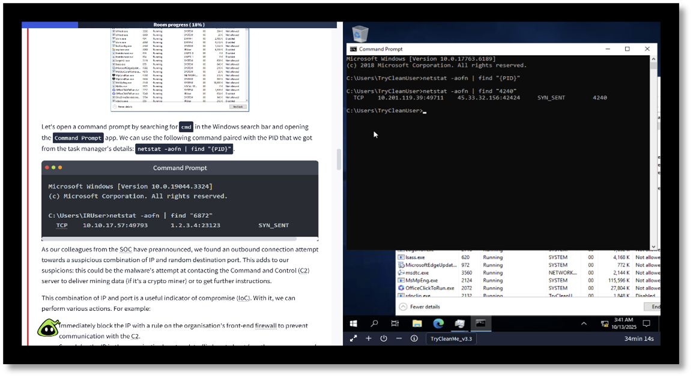
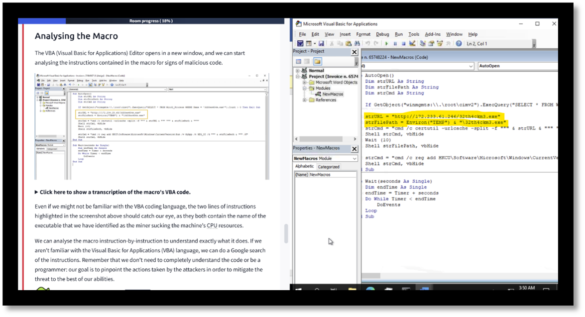
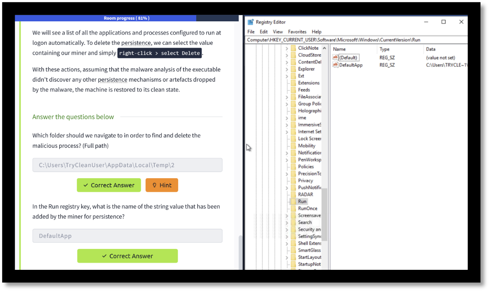
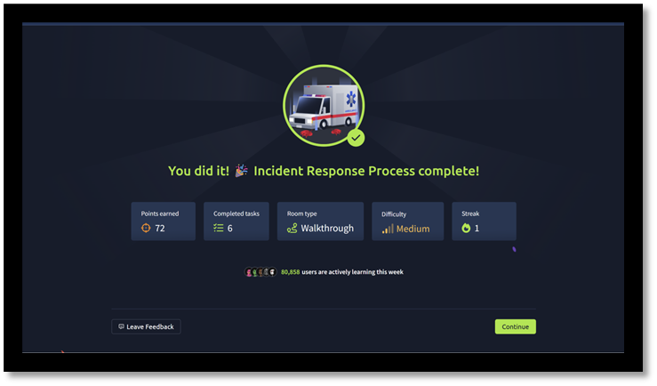

# Incident Response Exercise-

### TryHackMe
### Alessandro Di Giovanni
### ITECH1502 

---

## Project Summary
- **The Project:** demonstrates a hands-on incident response exercise completed on the TryHackMe 
- **The activity:** simulated a real-world cybersecurity investigation focused on detecting and removing a malicious file from a Windows system
- **The goal:** was to apply incident response steps in a controlled environment while developing practical investigation skills and also analysis skills

---

## Learning Objectives
- Understand the steps of the incident response process
- Detect and analyse suspicious files
- Investigate registry entries linked to malware
- Apply safe remediation techniques

---

## Tools & Platforms Used
- TryHackMe (Incident Response Room)
- Windows Task Manager
- Microsoft Word (View Macros)
- Windows Registry and Editor

---

## Screenshots / Evidence
### 1. Command Prompt & Task Output
Shows the commands executed and the results observed during the investigation.

### 2. Macro Analysis in Word
Confirms the presence of an active macro in the suspicious .docm file.

### 3. Registry Editor – Persistence Entry
Displays the default app key added by the malicious file for automatic startup.

### 5. Completion Certificate
Proof of completion for the TryHackMe incident response exercise.

---

## Reflection
- This exercise helped me gain hands-on experience in identifying malicious behaviour and understanding how threats persist in systems
- It strengthened my technical and analytical skills, which are essential for future roles in incident response and SOC environments

---

## 📎 Related Files
- [Project Report (PDF)]()
- [Presentation Slides (PPTX)](link-to-your-presentation.pptx)
